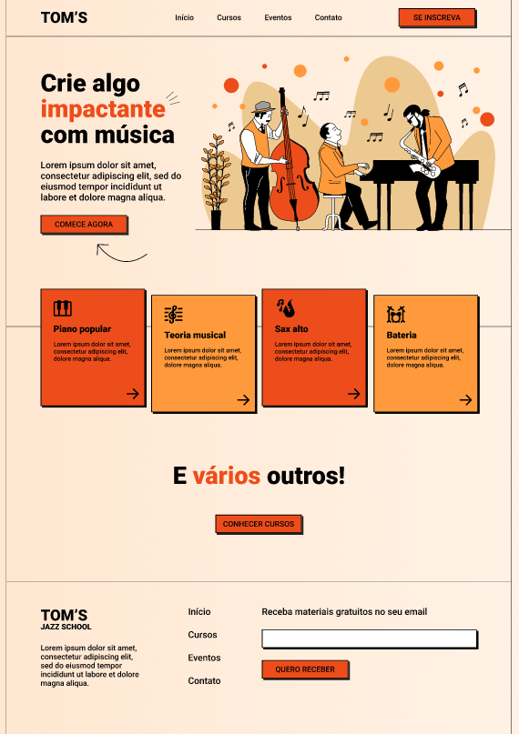

## PROJETO [OneBitCode](https://pro.onebitcode.com/?utm_campaign=OBC-C+|+E0-UNC+|+CAR+|+SCH+|+T1S-BRD+|+CPA+|+BR+|+2022-11-10+|+FULL+STACK+|+Branding&utm_content=onebitcode&utm_term=00+|+SCH+|+Keywords+|++Branding&&utm_medium=paid-traffic&utm_source=g&ltk_gcm=20126792132&ltk_gag=155881055264&ltk_gac=665307142693&ltk_gne=g&gad=1&gclid=Cj0KCQjwuNemBhCBARIsADp74QRw0i_Y6yaMorsV1zM6qRbroKyRMdPegFtnbRNZ550Hf5GnPWrknMEaAhQxEALw_wcB): 
### Landing Page com HTML e CSS a partir do Figma

 

## 🚀 [Ver página no GitHub Pages](https://geovanaborba.github.io/Curso_OneBitCode/Landing%20Page%20com%20HTML%20e%20CSS/) 

### 🎨 [Mockup da Landing Page](https://www.figma.com/file/76GJ4uK7PyKeAo6dcpVyjA/Tom's-Jazz-School?type=design&node-id=0-1&mode=design)

### 📂 [Arquivos utilizados](https://drive.google.com/drive/folders/1JQ1XixDVu4H9Czi0QtOHoWxF8LHhZtDR)

### 💻 [Vídeo aula - PARTE 1](https://www.youtube.com/watch?v=Wo7UnH8TYbc&t)

### 👩🏽‍💻 [Vídeo aula - PARTE 2](https://www.youtube.com/watch?v=b9Vw_LUyYmc&t)

 

  

### Alterações após terminar de assistir as aulas:

 

* Alinhamento flex-start aplicado no rodapé, além de aumento do tamanho da fonte do nav, a partir de (min-width: 72rem)

* Tamanho do input no rodapé ajustado, para se aproximar ao layout do Figma

* Itens no header espaçados adequadamente

* Alteração de cor em todos os botões ao passar o mouse

* Efeito de zoom nos cards, com alteração de cor nas setas ao passar o mouse

* Mudança de cor em todos os links ao passar o mouse

