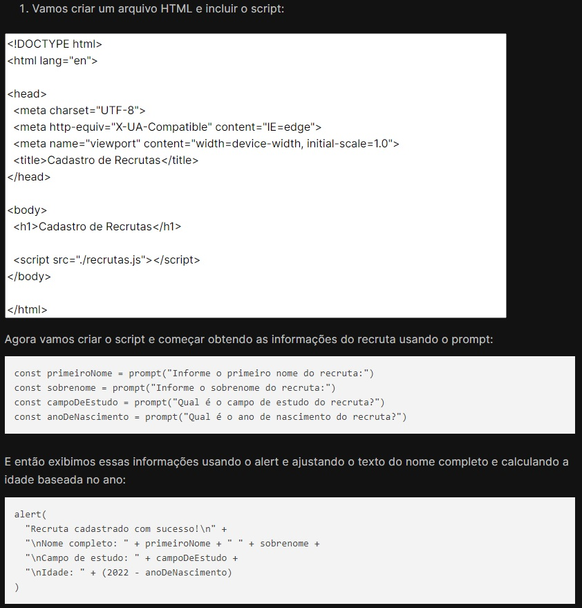

## Cadastro de Recrutas

Escreva um programa em JS que permita salvar informações de um recruta. As informações a serem salvas são: 

* o primeiro nome

* o sobrenome 

* o campo de estudo 

* o ano de nascimento

Depois, o programa deve exibir o nome completo do recruta, seu campo de estudo e sua idade (apenas baseada no ano de nascimento).

 

### 📖 Resolução em aula

A resolução em aula propunha que fosse feito o 'cadastro', com preenchimento dos inputs por meio do "window.prompt" e os dados fossem exibidos com um 'window.alert', utilizando uma página html apenas para acionar esses alertas.

 

Entretanto, quis deixar a página mais bonita e intuitiva. Fiz um pequeno form para inserção das informações e com um botão submit, para que assim seja acionado o alert com as informações 'cadastradas'. 

### 📌 Resultado

 

## [🚀 Ver página no GitHub Pages]()