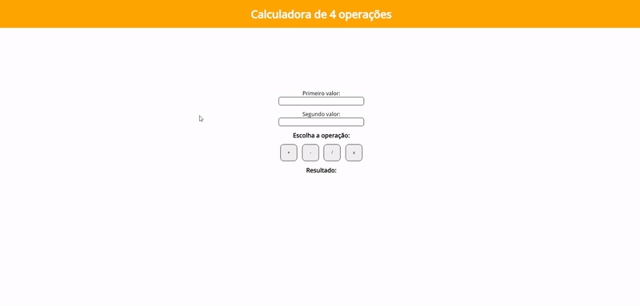
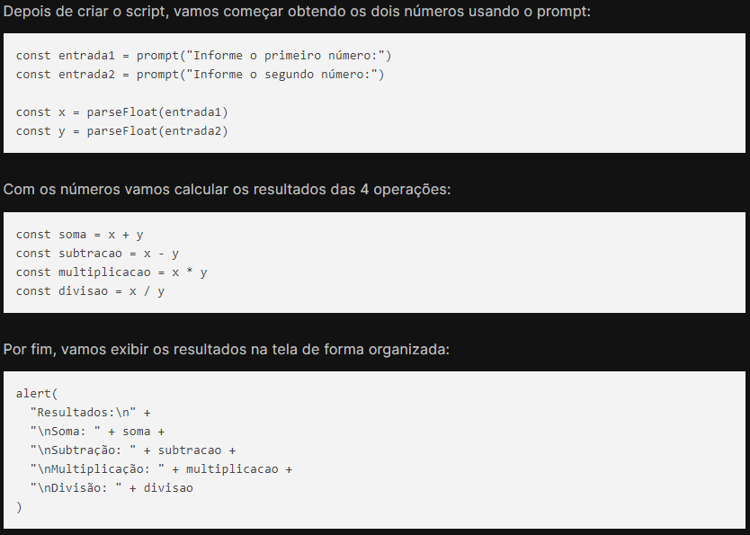

## Calculadora de 4 Operações

Escreva um programa em JS, que permita inserir dois valores numéricos e então calcule o resultado das quatro operações básicas (soma, subtração, multiplicação e divisão).

Após calcular os resultados, o programa deve exibí-los na tela. 

 

## [🚀 Ver página no GitHub Pages](https://geovanaborba.github.io/Curso_OneBitCode/Módulo%20JS/Exercício%201%20-%20Cadastro%20de%20usuário%20-%20Calculadora%20de%204%20operações/Calculadora%20de%204%20operações)

 

### 📌 Resultado: 

Nesse exercício a proposta também era utilizar apenas prompt e alert no JS, entretanto, fiz uma calculadora simples com html e css por meio de inputs e botões, fazendo com que esses sejam acionados por meio de funções e mostrando o resultado através de innerHTML.

### 📖 Resolução proposta em aula: 

