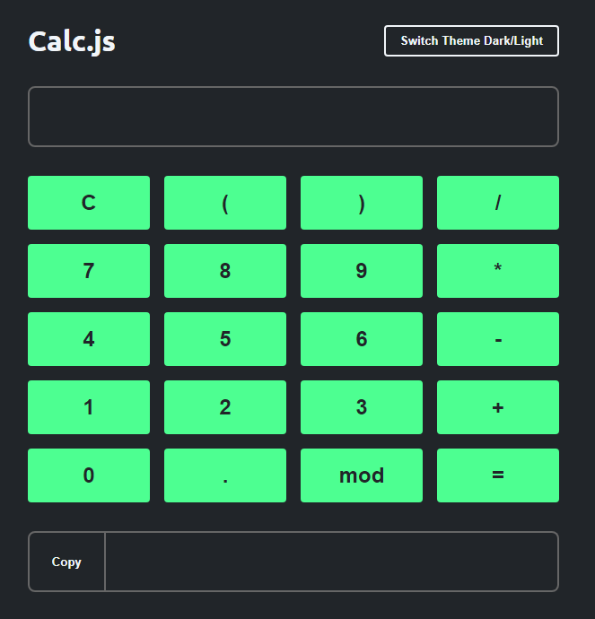

## Projeto Prático Guiado

### Criando uma Calculadora com HTML, CSS e Javascript

Construindo um projeto prático, utilizando conhecimentos adquiridos até agora de JavaScript e manipulação do DOM.

 

## [🚀 Ver resultado no GitHub Pages](https://geovanaborba.github.io/Curso_OneBitCode/M%C3%B3dulo%20JS/Projeto%20Prático%20-%20Calculadora%20com%20HTML%20CSS%20e%20JavaScript)

 

